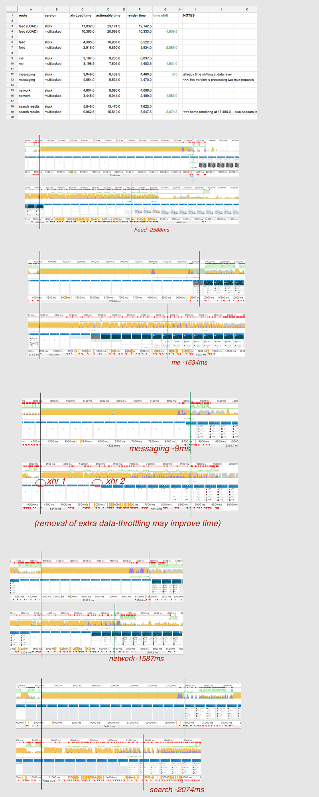
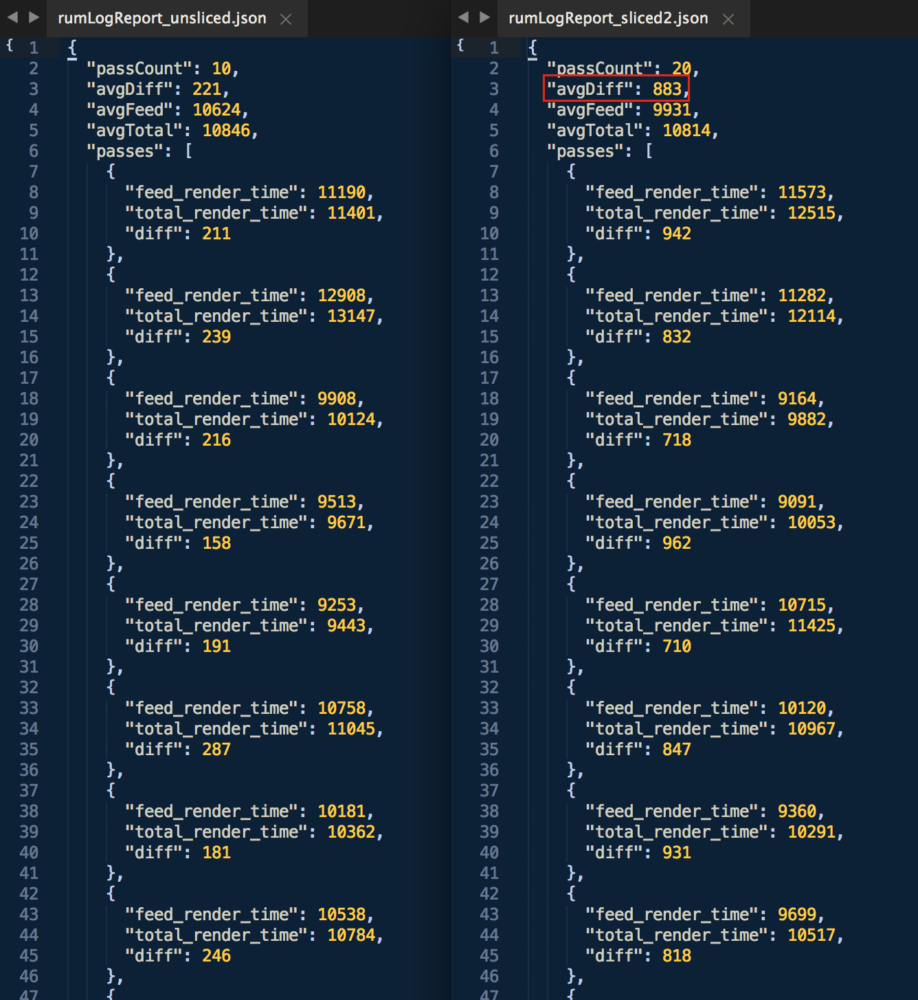

#Timeslicing RFC

##Summary
Ember is slow to render view updates to the screen.

A perceptual speed improvement can come from “time-slicing” Ember’s internal Ember.run() loop -- which blocks browser render cycles for long periods of time during route changes.

###Negative effects seen in large and complex app
- slow view updates
- blocking on basic browser interactions (e.g. scrolling) during route transitions

###Desired behavior:
Make the negative effects above less bad.

###Strategy:
Add notion of "yield" to Ember internals (including Backburner and HTMLBars components) such that Javascript yields for browser paint cycles during CPU-intensive activities (e.g. route changes, xhr response etc...)

Yield intervals should be state-aware and "tunable" such that good paint-to-speed performance can be programmatically throttled based on UX priorities. (e.g. potentially not yielding when there are no new paints available and enable fewer yields when task queues increase etc...)

###Performance Metrics:
- time from ajax data received to an actionable UI display
- subjective, side by side comparison the new version should feel more responsive.

#### Early performance results
Using just serve and manually timing churn from API response to an "actionable" view.

#### Recent performance results
Using a different server harness (more like production enviornment) and generating perf markers via script tags in the DOM.

*Currently not sure why earlier tests show better results -- there many differences between the two tests -- so a better understanding may take some time.*

